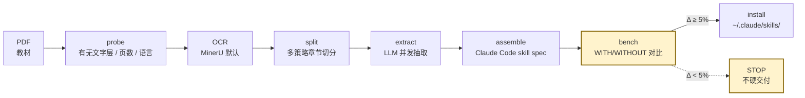

<div align="center">

# textbook2skill

**把任意 PDF 教材编译成可被 Claude Code / OpenAI Codex 调用的领域知识 skill。**

_A meta-skill that compiles any textbook PDF into a Claude Code skill — with mandatory benchmark gating._

[](LICENSE)
[](https://code.claude.com/docs/en/skills)
[](https://developers.openai.com/codex/skills)
[](https://www.python.org/)
[](#real-world-benchmark)

[Quickstart](#quickstart) · [What it actually does](#what-it-actually-does-honest-version) · [How it works](#how-it-works) · [Benchmark](#real-world-benchmark) · [When NOT to use](#when-not-to-use) · [Pitfalls](pitfalls.md)

</div>

---

## TL;DR（更新于 2026-05-06，4 本压测后）

```
PDF → probe → OCR → 切章 → LLM 抽取 → 组装 → benchmark → 安装
                                                ▲
                                        没有 benchmark 就没有 skill
```

一条 pipeline 把一本 300 页的专业教材，**约 10 分钟编译时间 + 30-90 分钟 OCR 网络等待**，变成一个 Claude Code 自动路由、可验证、可复用的领域专家 skill。

**4 本压测 + V0 共 5 case 实测后**：
- **整书层面**：5 本里 4 本 Δ 落在 ±5pp 噪声内，1 本（T1 主流学科）-2pp（轻度拖累）—— skill 不是"通用知识增强器"
- **真信号**：跨 case **hard 子集观察到 +10-29pp 正向收益**（样本 n=7-10，需更大 eval 确认，目前是"最有希望的方向"非"已证明")
- **跨 skill 路由稳健**：4 本同装时 top-1 routing 92.7%, misroute 0.8%, 教材外问题 reject recall 100%
- **杀手场景仍待验证**：理论上 LLM 训练稀缺的领域（公司私有 SOP、新发布法规、小语种学术）应有 +30%+，但本次 4 本主流教材**未能验证**

> 这是个**更窄但能站得住脚**的产品故事。窄不可怕，假大空才可怕。

---

## What it actually does (honest version)

| 你期望它做的 | 数据是否支持 |
|--------------|--------------|
| 让 LLM 在该教材领域**整体**更准 | ❌ 主流学科 LLM baseline 已经强（82-98%），整书 Δ 落在 ±5pp |
| 让 LLM 在 hard / 多步推理 / 教材独有口径题上更准 | 🟡 跨 5 case 观察到 +10-29pp，方向稳定，**样本小需扩大确认** |
| 公式密集章节 +50% | ❌ V0 单本现象，T2 BSM 推导（更标志性的公式章）只 +3.3% — 不可复现 |
| 冷门领域 +30% | ❓ 理论上有，4 本主流教材没找到合适样本验证 |
| 多 skill 同装不互相串味、教材外问题不乱答 | ✅ 4 skill 同装时 top-1 routing 92.7%, reject recall 100% |
| 一次编译，10 分钟出 skill，<$1 LLM 成本 | ✅ 本次 4 本压测总 LLM 成本 ~$0.9 |
| OCR / LLM / 安装位置由用户决策（不替你决定） | ✅ 6 个交互决策点 + AskUserQuestion 严格格式 |

---

## Quickstart

> **30 秒**装好，**一句话**触发。

```bash
# 1) 装到个人 skills 目录
git clone https://github.com/niuniu-869/textbook2skill.git \
  ~/.claude/skills/textbook2skill

# 2) 准备依赖
pip install requests
sudo apt-get install -y qpdf poppler-utils      # macOS: brew install qpdf poppler

# 3) 拿到两个 key（运行时按需输入，不硬编码）
export MINERU_TOKEN=...        # 扫描版 PDF OCR
export DEEPSEEK_KEY=...        # LLM 抽取（默认，最便宜）

# 4) 在 Claude Code 里触发
#    /textbook2skill   或者直接说："把 /path/to/book.pdf 做成 skill"
```

Claude 会按 `SKILL.md` 走完 pipeline，在 6 个关键决策点用 `AskUserQuestion` 跟你确认。最后输出：

```
DONE — skill `<your-textbook-slug>` installed at ~/.claude/skills/<your-textbook-slug>
Coverage: N 章 / X 个核心概念
Benchmark: WITH x% / WITHOUT y% / Δ +z% (95% CI: [a, b])
路由准确率: A%
判断: <推荐 / 价值有限 / 不建议交付>
```

---

## When NOT to use

基于 4 本压测数据，下面几类场景**不建议**用 textbook2skill 编译 skill：

1. **主流学科基础课**（如《会计学原理》）—— LLM baseline 已经 ≥ 95%，skill 没空间提升、甚至轻度拖累
2. **教材内容是"标准化定义 + 通用算法"**（如经典数据结构、入门 Python）—— LLM 自带知识充分
3. **教材里大半章节都是"案例 / 习题 / 解答"**（如 T3 工程经济学英文版）—— 切章策略会过分裂，路由质量受影响
4. **教材没有清晰章节结构**（标题被 OCR 拆碎、用户手写笔记 PDF 等）—— pipeline 会跑通但 skill 内容松散

**值得用的场景**：
- 教材有**独特口径** / 命名 / 推理方法（与 LLM 训练语料里的"主流写法"不同）
- 你需要 LLM **在多个领域之间正确路由 + 教材外问题正确拒答**
- 你想把 PDF 教材**永久压缩进 LLM 工作流**而不是每次喂全文（vs RAG）

---

## How it works



**8 个步骤，每步独立可重跑**（详见 [`steps/`](steps/)）：

| # | 步骤 | 说明 | 骨架代码 |
|---|------|------|---------|
| 1 | prerequisites | 收集 PDF 路径 / skill 名 / 安装位置 | — |
| 2 | probe | 文字层 / 页数 / 语言探测 | [`skeleton/probe.py`](skeleton/probe.py) |
| 3 | OCR | MinerU 默认（可换 Mistral / Anthropic Files） | [`skeleton/ocr_mineru.py`](skeleton/ocr_mineru.py) |
| 4 | split | TOC-first → H1+size（含 mid-section 过滤）→ 语义锚点 → LLM 兜底 | [`skeleton/split.py`](skeleton/split.py) |
| 5 | extract | 默认 DeepSeek-v4-flash（便宜），并发抽取 | [`skeleton/extract.py`](skeleton/extract.py) |
| 6 | assemble | 符合 [Claude Code skill spec](https://code.claude.com/docs/en/skills) | [`skeleton/assemble.py`](skeleton/assemble.py) |
| 7 | **bench** | **必跑** WITH/WITHOUT + McNemar 检验 | [`skeleton/bench.py`](skeleton/bench.py) |
| 8 | install | backup-then-copy（不 `rm -rf` 旧 skill） | — |

**新增工具**：[`skeleton/chapter_quality_report.py`](skeleton/chapter_quality_report.py) — 切章质量分析（章数/标题形态/重复标题等），用于 patch 前后对比验证。

端到端编排器：[`skeleton/pipeline.py`](skeleton/pipeline.py)。

---

## Real-world benchmark

完整 5-case 数据（2026-05-05 → 2026-05-06，1 本 V0 baseline + 4 本压测）。

### 5 case 总表

| Case | 教材 | 页/MB/语言 | 章数 | 题量 | WITH | WITHOUT | Δ | Hard Δ | 路由 |
|------|------|------|------|------|------|---------|-----|--------|------|
| V0 | 高级管理会计 | 330/76/中 | 11 (TOC) | 31 | 90.3% | 83.9% | +6.5% | +17% | 90% |
| T1 | 会计学原理 | 240/12/中 | 6 (TOC) | 50 | 96.0% | 98.0% | **-2.0%** | 0% | 100% |
| T2 整书 | 金融工程 第4版 | 332/180/中 | 21 (h1-size) | 54 | 88.9% | 85.2% | +3.7% | **+29%** | 67% |
| T2 公式章 | T2 BSM 推导（pre-reg top-2） | — | 2 | 30 | **100%** | 96.7% | +3.3% | +10% | 47% |
| T3 | Engineering Economy 14e | 692/270/英 | 131 (h1-size) | 100 | 91.0% | 89.0% | +2.0% | n/a | 49% |
| T4 | 服务科学与服务管理 | 418/197/中 | 7 (h1-size) | 50 | 84.0% | 82.0% | +2.0% | 0% | 57% |

> 注：T2 公式章是 T2 整书的 pre-register 专项切片，不构成独立 case；T3 用 `--allow-partial` 跑通（参考文献章关键词缺失），不与全量 case 同权重比较；hard 子集样本量小（n=7-10），方向值得押注但不能下硬结论。

### Cross-skill 4×5 confusion matrix（4 skill 同装路由测试，150 题）

```
expected \ predicted    T1    T2    T3    T4   REJECT
hui-ji-xue-yuan-li      30     0     0     0     0
jin-rong-gong-cheng      0    28     0     0     2
engineering-economy      0     0    27     0     3
fu-wu-ke-xue             0     0     1    24     5
REJECT                   0     0     0     0    30
```

- **top-1 routing accuracy: 92.7%**
- **misroute rate (in-domain): 0.8%**
- **reject precision 75% / reject recall 100%**
- description 移除关键词 ablation：Δ < 1pp（路由不依赖单个关键词）

### 6 假说裁定（v2 协议 pre-register）

| H | 内容 | 实测 | 状态 |
|---|------|------|------|
| H1 | pipeline 在 4 本上跑通 | 4/4 (T3 用 --allow-partial) | ✅ PASS |
| H2 | T2 预注册公式章 Δ ≥ +15pp | +3.3pp | ❌ REFUTE |
| H3 | T4 整书 Δ 比 T1/T2 大（exploratory） | T4 +2% ≈ T2 +3.7% | ❌ REFUTE |
| H4 | T3 跑通 + 章节路由 ≥ 70% | 跑通 + 49% | 🟡 PARTIAL |
| H5 | T1 WITHOUT ≥ 80% | 98% | ✅ PASS |
| H6 | top-1 ≥ 80%, misroute ≤ 15% | 92.7%, 0.8% | ✅ PASS |

**3 PASS / 1 PARTIAL / 2 REFUTE**：基础设施（H1/H5/H6）坚实，产品价值假说（H2/H3）双双不成立。

### 数据/方法学局限性（必须知道）

- McNemar exact + Wilson CI 都报，但 hard 子集 n=7~10 样本小，+10-29pp 可能只对应 1-2 题净差
- 5 case 都是中英文主流教材，未触及 LLM 真正训练稀缺的领域
- 出题用 deepseek-v4-flash 同模型自评 → grading 偏置可能存在
- 题型限 MCQ + 填空（自动评分）；论述 / 推导 / 多步证明未覆盖
- T1 的 -2pp 用 paired McNemar (b=0, c=1) 看：实质是 18 题 easy 子集少答对 1 题，单题级别现象，不是大规模拖累

完整压测数据（含每本 summary、cross-skill confusion、description ablation）见 `/Token-Exchange/temp/textbook2skill_压测_2026-05-05/`（运行时自动生成）。

---

## V0 → v0.2 改动

```
2026-05-05 → 2026-05-06: 4 本教材压测（金融工程/会计学原理/工程经济学英文/服务科学）+ Codex review
```

### 切章质量改进（合 P0-A patches）

跑 `chapter_quality_report.py` 在 4 本上 BEFORE → AFTER：

| Build | BEFORE | AFTER | 关键变化 |
|-------|--------|-------|---------|
| T1 会计学原理 | 10/10 good | 10/10 good | 不变 |
| T2 金融工程 | 5/10 fair-leak | **7/10 fair** | mid-section 过滤剔除 6 个非章节 H1 |
| T3 工程经济学 | **0/10 poor** | **10/10 good** | **131 章 → 14 真英文章节**（over-fragmentation 兜底） |
| T4 服务科学 | 6/10 fair-leak | 7/10 fair | OCR 本身没真章节级 H1（已尽力）|

详见 `skeleton/split.py` 的 `is_real_chapter_title()` + `split_by_h1_size(reject_mid_section=True)`。

### Pitfalls 增量（V0 之外新踩）

V0 实测 9 大坑见 [`pitfalls.md`](pitfalls.md)。本次压测新加 9 条（P22-P30），完整记录在压测目录的 `99-final-report.md`。**top 3**：

1. **P22**：`ocr_mineru.py:154` 旧 idiom 对 `"Pages: 332"` 整行 `int()` 抛 ValueError —— 已修
2. **P25**：英文教材 TOC strategy 不匹配（中文模板写死 `第N章`），退化到 h1-size 切出 131 章 —— 已修（mid-section 过滤 + over-fragmentation 兜底）
3. **P26**：参考文献 / 习题答案 / 附录章合法可无 keyword，应豁免 keyword check —— 已修（`assemble.py: APPENDIX_TITLE_PATTERNS`）

---

## Configuration

### 选 OCR 厂商

`SKILL.md` 在 step 3 用 `AskUserQuestion` 让你选：

| 厂商 | 何时选 | 状态 |
|------|--------|------|
| **MinerU** | 中文扫描版 / 公式多 / 不想自己部署 | ✓ 默认（已实现） |
| Mistral OCR | 英文文档 / 已有 Mistral key | 路线图 |
| Anthropic Files API | 已有 Claude API quota | 路线图 |
| 自部署 marker | 数据敏感 / 不想出网 | 路线图 |

**国内访问 MinerU OSS 单连接 ~14-26 KB/s**——4 本 200MB+ PDF 并发上传共享带宽，每本上传 1-3 小时。压测预算请按 4-6 小时网络等待算。

### 选 LLM 厂商

| 厂商 / 模型 | 何时选 | 状态 |
|------------|--------|------|
| **DeepSeek-v4-flash** | 默认（最便宜，reasoning 质量好） | ✓ 已实现 |
| GPT-4o / GPT-5 | 已有 OpenAI quota | ✓ 已实现 |
| Claude Sonnet / Opus | 中文复杂语境 / 已有 Anthropic quota | ✓ 已实现 |

> ⚠️ **不要传 `max_tokens` 和 `temperature`**——DeepSeek-v4-flash 等 reasoning 模型设了反而 content 为空（[P1 坑](pitfalls.md)）。

---

## FAQ

<details>
<summary><b>这跟把 PDF 喂给 Claude / RAG 有什么区别？</b></summary>

- **RAG / 长上下文**：每次查询动态检索，token 成本随查询数线性增长
- **textbook2skill**：一次性把教材**结构化压缩**成 skill 文件，写到 `~/.claude/skills/`，未来所有 Claude Code 会话**自动按 description 路由**到这个 skill，不用每次重新喂 PDF
- 数据上看：4 本压测 cross-skill 路由 92.7%、reject 100%——多 skill 共存的运维体验上 textbook2skill 是真实可用的
- skill = "训练好的领域专家"；RAG = "每次查字典"。两者可叠加。
</details>

<details>
<summary><b>为什么必须跑 benchmark？</b></summary>

主流学科 LLM baseline 已经很强（管理会计 84%、会计学原理 98%、金融工程 BSM 公式章 96.7%）。**不跑 benchmark 你根本不知道 skill 加了多少分**——可能花 10 分钟做出一个 +0% 甚至 -2% 的 skill 而不自知。

`textbook2skill` 用 ≥ 50 题 WITH/WITHOUT 对比 + McNemar 显著性检验 + Wilson 95% CI，差距 < 5% 时 STOP 不硬交付。底线，不是判决。
</details>

<details>
<summary><b>支持英文教材吗？</b></summary>

**ALPHA 阶段**。本次 T3 (Engineering Economy 14e, 692页) 跑通了 pipeline，但章节路由质量较低（49%）。如果你的英文教材：
- TOC 用 `# Contents` / `# Table of Contents` / `# 目 录` heading
- 章节是规范的 `Chapter N: Title`、`Part I/II/III`、`Section N`
那么大概率能跑出 good quality 切章。OCR 输出杂乱（每个 EXAMPLE / Solution 都是 H1）的英文教材会被 over-fragmentation 兜底剪到 ~10-30 章。

如果你想把英文教材的体验做到中文那种 quality 10/10 的水平，**欢迎 PR 加更多英文 TOC regex**。
</details>

<details>
<summary><b>处理一本书要多少钱？</b></summary>

V0 实跑（330页中文管理会计）+ 4 本压测：
- MinerU OCR：免费 quota 内（注册送）
- DeepSeek 抽取（4 本并发）：< $0.40
- DeepSeek benchmark（380 题×2 + cross-skill 750 calls）：< $0.50
- **总成本 4 本 ~$0.9**

换 Claude Sonnet 抽取约 10x 成本，质量提升对主流学科**不显著**（参考 5 case 数据）。
</details>

<details>
<summary><b>能批量处理多本书吗？</b></summary>

V0 设计为"一次一本"——每本都要 6 个交互决策点。批量场景（图书馆、教材出版社）建议自己写 wrapper 调 `skeleton/pipeline.py` + 预先填好 config，绕过 `AskUserQuestion`。

**MinerU 单 token 多并发上传会共享带宽**（~14-26 KB/s 共享），不是真并发。建议串行 OCR、并发 LLM 抽取（DeepSeek 高并发友好）。
</details>

<details>
<summary><b>跟 Anthropic 官方 skill 规范一致吗？</b></summary>

`SKILL.md` 严格按 [Claude Code skills 文档](https://code.claude.com/docs/en/skills) 写：
- frontmatter 含 `name` / `description` / `when_to_use` / `allowed-tools`
- 工作流文档化在 `steps/`
- 关键决策走 `AskUserQuestion`

OpenAI Codex 侧用 `agents/openai.yaml` 平行声明（`allow_implicit_invocation` 等）。
</details>

---

## Pitfalls (must-read)

V0 + 4 本压测 = 18 个坑，按成本排序在 [`pitfalls.md`](pitfalls.md)。**top 5**（每个都至少多花 30 分钟）：

1. **DeepSeek-v4-flash 设了 `max_tokens` → content 为空**（reasoning 模型陷阱）
2. **章节切分用 `# 第N章` 正则 → TOC 条目被误识别成章节**
3. **OCR 偶尔丢章节号 → 漏章**（要用 strategy chain 兜底）
4. **subagent 跑 pipeline 必须用 `nohup ... &` detach**（tee 模式 agent 退出时被 SIGHUP）
5. **MinerU 国内带宽 14-26 KB/s + 多并发共享**（200MB PDF 上传 1-3 小时）

---

## Roadmap

按 4 本压测数据的优先级排序：

- [ ] **P0 切章策略 chain 加固**（已部分完成 T3 修复，T2/T4 仍需 OCR 端配合）
- [ ] **P0 Soft engagement / 注入强度 ablation**：避免在 LLM 已熟练的 easy 题上 over-engage（T1 -6% 来源）
- [ ] **P1 README 重写**（已完成 v0.2 → 当前文件）
- [ ] 在**真正训练稀缺的领域**跑出 +30% 的 case（公司私有 SOP、新发布法规、小语种学术教材）
- [ ] 多 OCR 提供商（Mistral OCR / Anthropic Files / 自部署 marker）
- [ ] LLM-as-judge 评分兜底
- [ ] 跨教材组合（让 Claude 同时用多个 skill 协同回答）
- [ ] Web UI（单 PDF drag-drop）
- [ ] 英文教材的系统性测试（当前 ALPHA）
- [ ] CI 集成（每次 PR 跑 examples/ 里的 mini-benchmark）

---

## Contributing

欢迎 PR。优先级最高的方向：

1. **在 LLM 不熟悉的领域跑出 +30% 的 case**——这是 textbook2skill 的真正杀手场景，4 本主流教材没验证出来
2. **新切章策略 / 改进 mid-section 过滤**（`skeleton/split.py` 的 `MID_SECTION_PATTERNS` / `REAL_CHAPTER_PATTERNS`）
3. **新 OCR / LLM 厂商 adapter**（参考 `skeleton/ocr_mineru.py` / `skeleton/llm.py` 的 `configs`）
4. **pitfalls 补充**（V0 + v0.2 18 条坑也只是部分场景）

提交时请：
- 跑通 `skeleton/pipeline.py` 完整 pipeline
- 提供 benchmark 数据（WITH/WITHOUT + 章节路由准确率 + paired McNemar b/c）
- 关键决策不要绕过 `AskUserQuestion`

---

## Design references

设计经过：

- **V0 实跑**（2026-05-02，330 页中文管理会计教材）
- **v0.2 4 本压测**（2026-05-05 → 2026-05-06，金融工程 / 会计学原理 / 工程经济学英文 / 服务科学）
- **Anthropic 官方 skill 规范对齐**（[code.claude.com/docs/en/skills](https://code.claude.com/docs/en/skills)）
- **OpenAI Codex skill 规范对齐**（[developers.openai.com/codex/skills](https://developers.openai.com/codex/skills)）
- **gstack 系列 skill 的交互模式参考**（`AskUserQuestion` 严格 D-编号 / ELI10 / Stakes / Recommendation / Pros-Cons / Net 格式）
- **Codex 多轮独立 review**（V0 review 7 个架构问题；v0.2 review 数据方法学 + P0 修订建议）

---

## License

[MIT](LICENSE) © 2026 textbook2skill contributors

---

<div align="center">

**没有 benchmark 就没有 skill。**
**当数据不支持你最初的故事时，改故事。**

_Made with educator-grade rigor for LLM-grade consumption._

</div>
